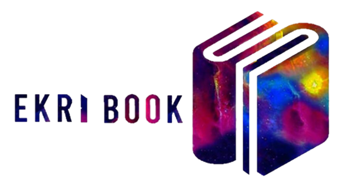

# Ekri Book

A website designed for book enthusiasts, offering a seamless interface for exploring, renting, and discussing a wide range of books. Built with the MERN stack, EkriBook aims to connect readers and foster a community around a shared passion for literature.

## Features 🎞️

- Logging in as a renter or a rentee
- Viewing ones's books 
- Making CRUD operations on them 
- Viewing all unrented books
- renting a book 


## Installation 🔧

Clone the repo:
```bash
git Clone https://github.com/CyrineZekri/EkriBook.git
```
    
## Contributions 📉	

Contributions are always welcome!

They are what makes the open source community such an amazing place to learn, inspire, and create. Any contributions you make are greatly appreciated.


## Authors

Made with ❤️ by: 
- [@CyineZekri](https://github.com/CyrineZekri)

